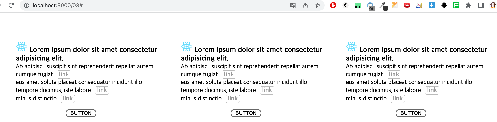

# styled-component 사용해서 리팩토링 해보기



1. `styled-component` 를 사용해서 index.tsx 파일과 index.css 파일을 리팩토링 해보세요
2. css파일 생성금지

```jsx
import React from "react";
import ReactDOM from "react-dom/client";
import { RouterProvider } from "react-router-dom";
import "./index.css";

const Homework = () => {
  return (
    <>
      <div className='container'>
        <div className='item'>
          <ul className='list'>
            <li>
              
              <h3 className='subTitle'>
                Lorem ipsum dolor sit amet consectetur adipisicing elit.
              </h3>
            </li>
            <li>
              <span className='text'>
                Ab adipisci, suscipit sint reprehenderit repellat autem cumque
                fugiat
                <a href='#' className='link'>
                  link
                </a>
              </span>
            </li>
            <li>
              <span className='text'>
                eos amet soluta placeat consequatur incidunt illo tempore
                ducimus, iste labore
              </span>
              <a href='#' className='link'>
                link
              </a>
            </li>
            <li>
              <span>minus distinctio</span>
              <a href='#' className='link'>
                link
              </a>
            </li>
          </ul>
          <button className='btn'>BUTTON</button>
        </div>
        <div className='item'>
          <ul className='list'>
            <li>
              
              <h3 className='subTitle'>
                Lorem ipsum dolor sit amet consectetur adipisicing elit.
              </h3>
            </li>
            <li>
              <span className='text'>
                Ab adipisci, suscipit sint reprehenderit repellat autem cumque
                fugiat
              </span>
              <a href='#' className='link'>
                link
              </a>
            </li>
            <li>
              <span className='text'>
                eos amet soluta placeat consequatur incidunt illo tempore
                ducimus, iste labore
              </span>
              <a href='#' className='link'>
                link
              </a>
            </li>
            <li>
              <span>minus distinctio</span>
              <a href='#' className='link'>
                link
              </a>
            </li>
          </ul>
          <button className='btn'>BUTTON</button>
        </div>
        <div className='item'>
          <ul className='list'>
            <li>
              
              <h3 className='subTitle'>
                Lorem ipsum dolor sit amet consectetur adipisicing elit.
              </h3>
            </li>
            <li>
              <span className='text'>
                Ab adipisci, suscipit sint reprehenderit repellat autem cumque
                fugiat
              </span>
              <a href='#' className='link'>
                link
              </a>
            </li>
            <li>
              <span className='text'>
                eos amet soluta placeat consequatur incidunt illo tempore
                ducimus, iste labore
              </span>
              <a href='#' className='link'>
                link
              </a>
            </li>
            <li>
              <span>minus distinctio</span>
              <a href='#' className='link'>
                link
              </a>
            </li>
          </ul>
          <button className='btn'>BUTTON</button>
        </div>
      </div>
    </>
  );
};

export default Homework;
```
