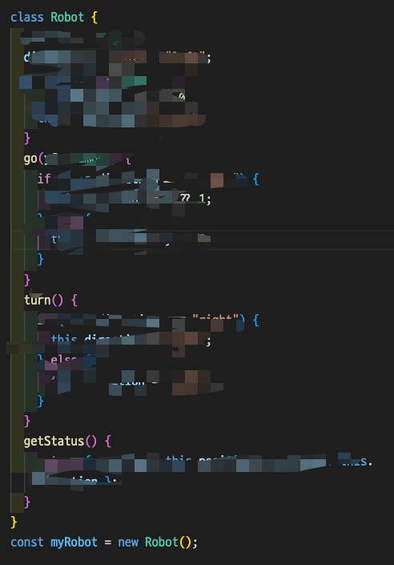

## 클래스 정의해보기

1. `Robot` 클래스를 정의하세요
2. `Robot` 인스턴스는 다음과 같은 속성을 가져야 합니다.
   - `position: number` (기본값 0)
   - `direction: "right" | "left";` (기본값 "right")
3. `Robot` 인스턴스는 메서드를 가져야 합니다.
   - `go()` direction이 'right'면 position 값이 1 증가, 'left'면 position 값이 1 감소
   - `turn()` direction 이 'right'면 'left' 로 변경. 반대도 마찬가지
   - `getStatus()` : 현재 Robot의 position 과 direction 상태를 객체로 반환해야 합니다.
4. 현재 로봇의 상태객체의 인터페이스 `IRobotStatus` 를 정의하세요
5. 동영상처럼 작동해야 합니다.

